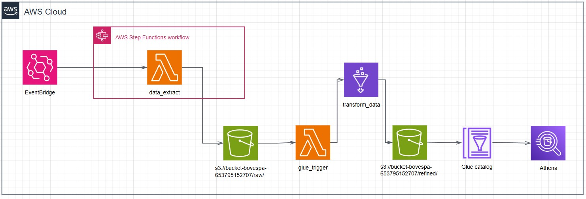

# ETL na AWS - Projeto da Pós Tech FIAP

Este projeto foi desenvolvido como parte do curso de Pós Tech da FIAP e tem como objetivo construir um pipeline de ETL na AWS.

A solução utiliza **AWS Lambda**, **S3**, **Glue** e **Athena** para realizar as seguintes etapas:

- **Web scraping** do site da [B3/Bovespa](https://sistemaswebb3-listados.b3.com.br/indexPage/day/IBOV?language=pt-br);
- Armazenamento dos dados brutos em formato **Parquet** no **Amazon S3**;
- Processamento, limpeza e transformação dos dados com **AWS Glue**;
- Disponibilização dos dados tratados para consulta via **Amazon Athena**.


## 📁 Estrutura do Projeto

```bash
5mlet_fase_2/
├── glue/
│   └── transform_data.py
├── img/
│   └── arquitetura.jpg
├── lambda/
│   ├── data_extract.py
│   └─  glue_trigger.py
└── README.md    
```

- **`glue/`**: Contém o script utilizado no AWS Glue para o processamento e transformação dos dados.
  - **`transform_data.py`**: Responsável por tratar os dados brutos, salvar os dados refinados no S3 e criar a tabela no Glue Catalog.

  - **`img/`**: Contém imagens png, jpg, etc..
  - **`arquitetura.jpg`**: Desenho da arquitetura do produto.

- **`lambda/`**: Contém os scripts executados por funções Lambda.
  - **`data_extract.py`**: Realiza a extração dos dados brutos via web scraping.
  - **`glue_trigger.py`**: Dispara automaticamente o job do AWS Glue sempre que novos arquivos são adicionados à pasta `raw` no S3.

- **`README.md`**: Este arquivo, com a descrição e instruções do projeto.

## 🏗️ Arquitetura do Projeto

